# Лабораторные работы и курсовая работа по компьютерной графике

Преподаватель: Морозов А. В.

Вариант: 2

## Лабораторная работа №1

**Вариант:** (x2+y2)2=a2(x2-y2)

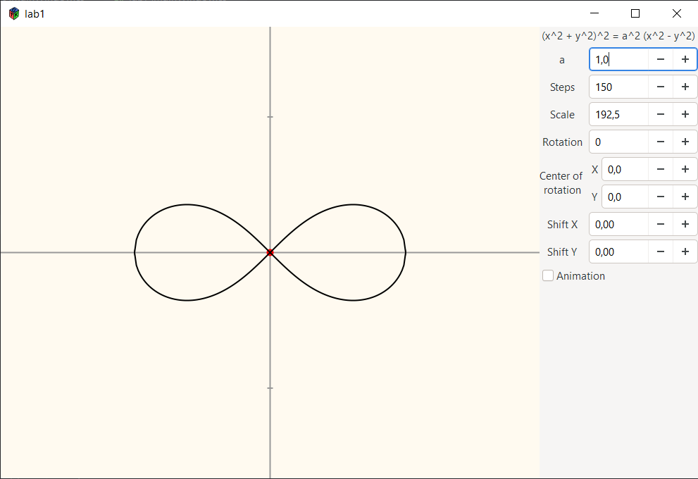

Дополнительно -- анимация отрисовки.

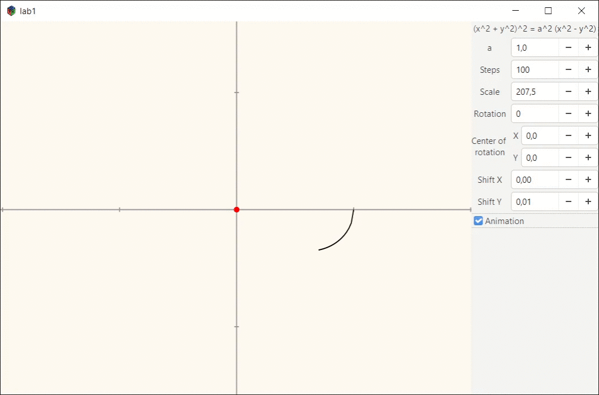

## Лабораторная работа №2

**Вариант:** Правильный октаэдр

Дополнительно к изометрии есть диметрия.  
Дополнительно к октаэдру -- куб и парсер obj файлов (несколько файлов лежат в [`./samples`](./samples)).

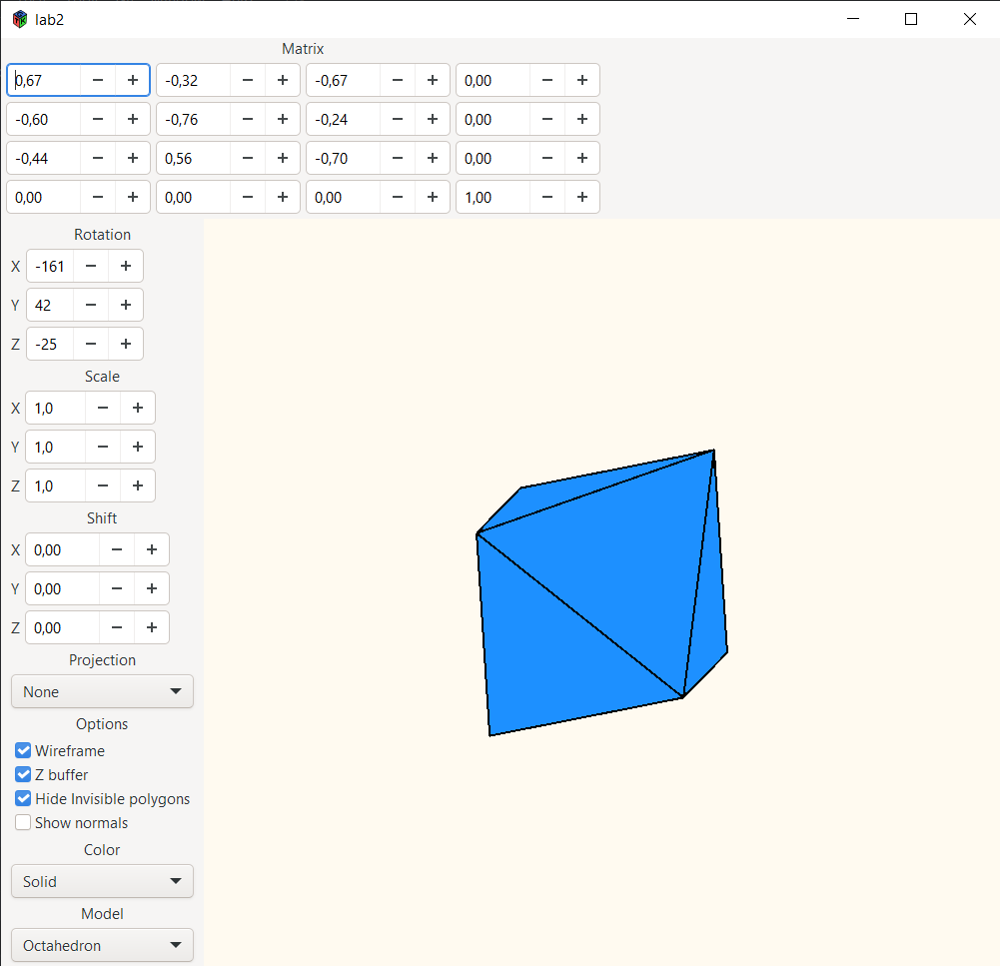

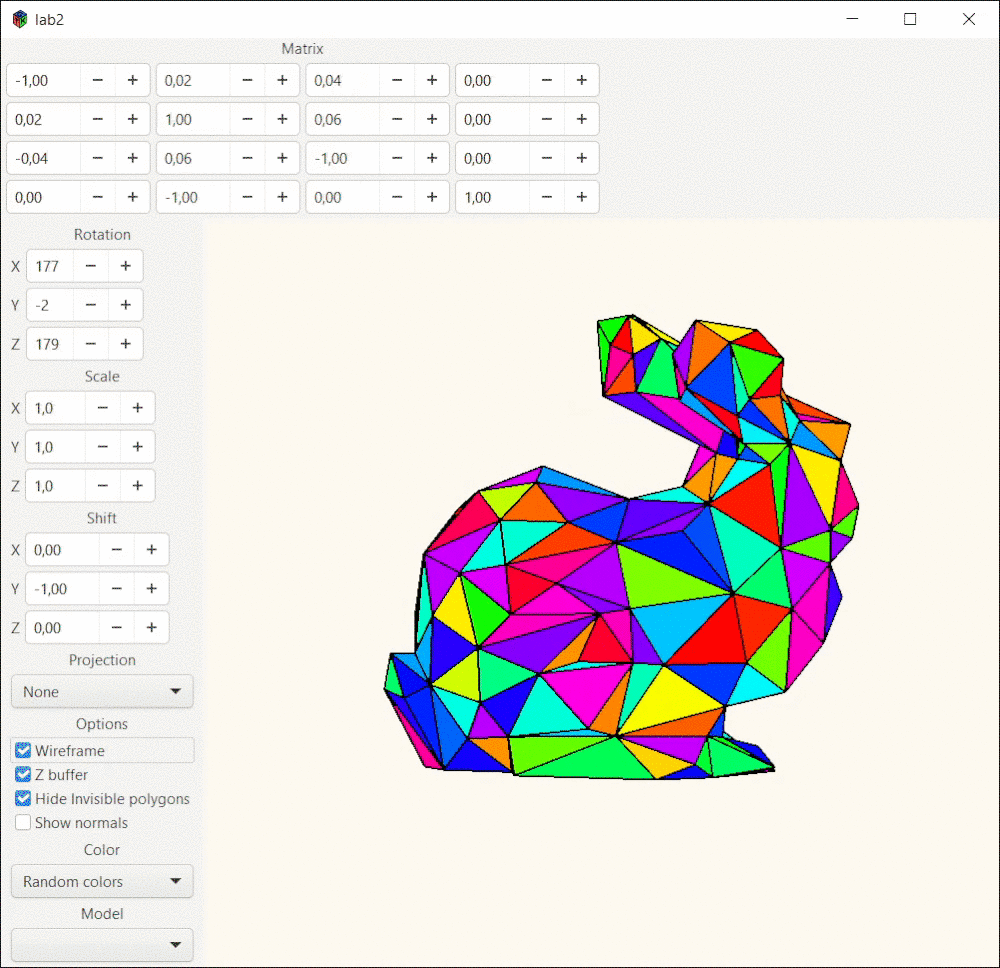

## Лабораторная работа №3

**Вариант:** Прямой эллиптический цилиндр

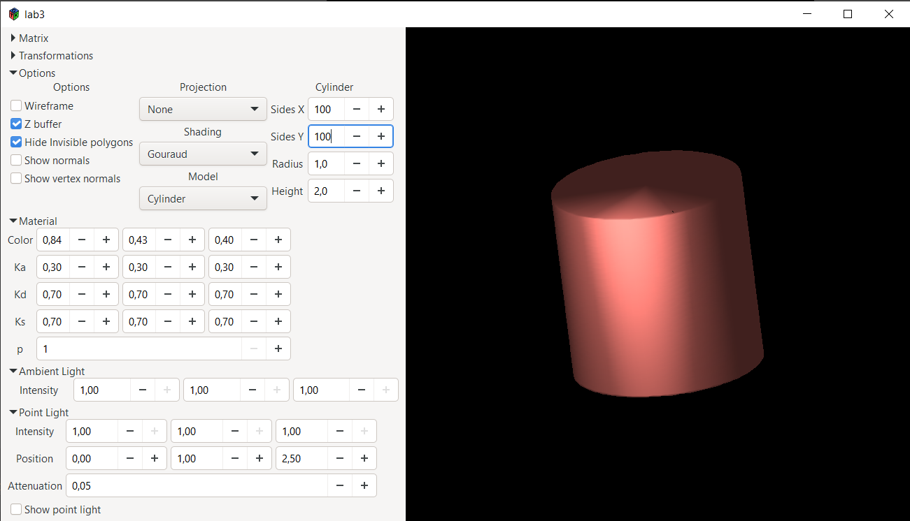

## Лабораторные работы №4,5

Дополнительно к Фонгу сделан Гуро и Блинн-Фонг. Визуализация нормалей через геометрический шейдер.

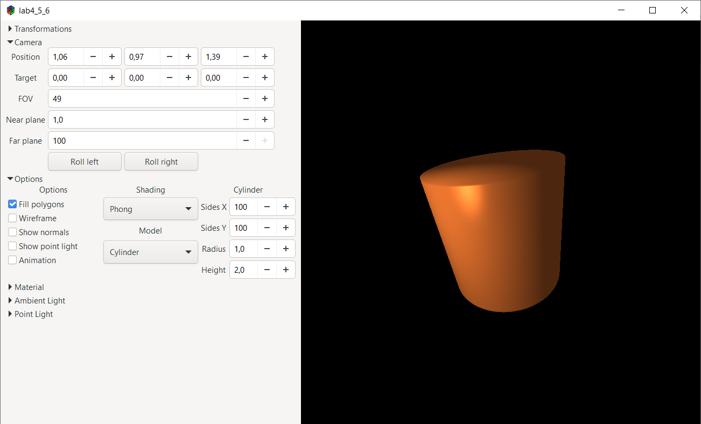
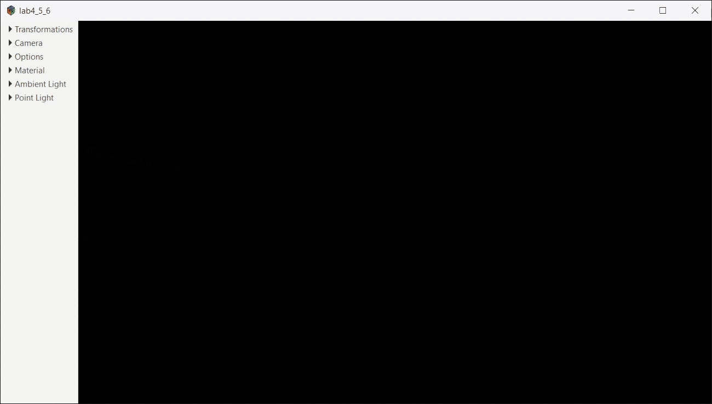

## Лабораторная работа №6

**Вариант:** Анимация. Цветовые координаты изменяются по синусоидальному закону

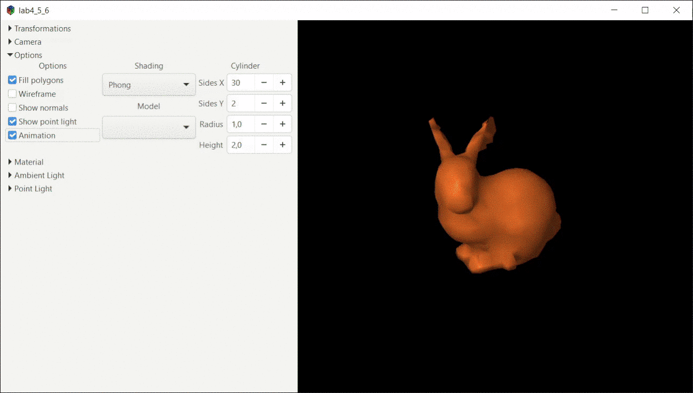

## Лабораторная работа №7

**Вариант:** Сегмент кубического сплайна по конечным точкам и касательным

Также известен под названием сплайн Эрмита.

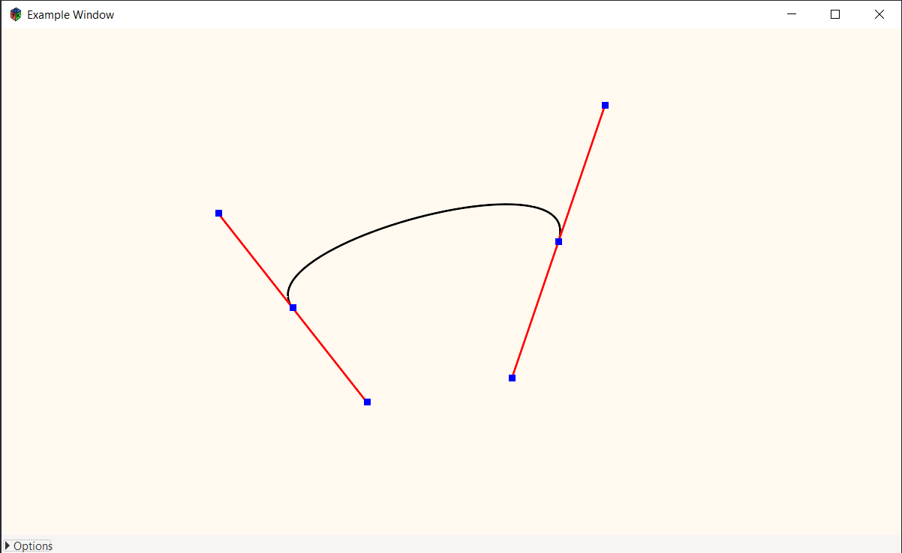

Дополнительно -- составной сплайн, касательные к каждой точке настраиваются отдельно.

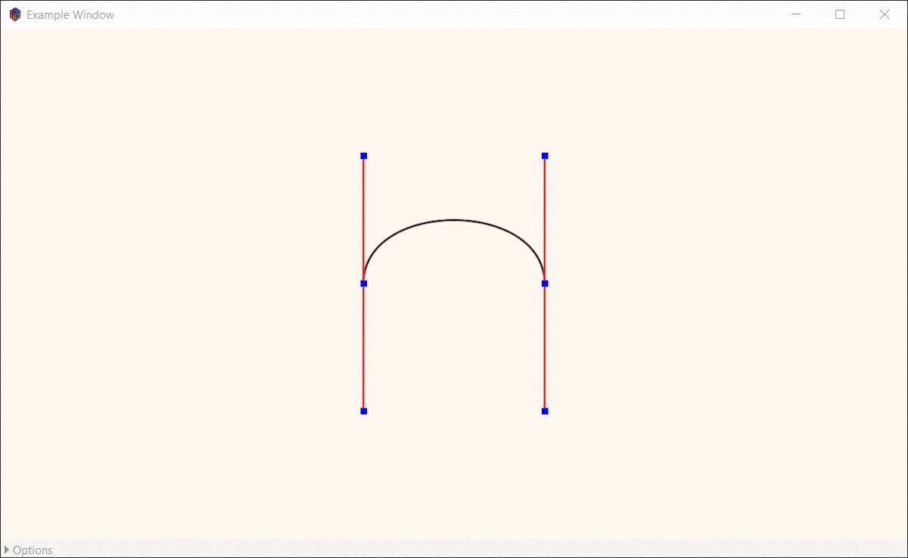

## Курсовая работа

**Вариант:** NURBS поверхность порядка 4x4

Точки двигаются, меняют вес по колесику. Цветовая индексация для сопоставления с кучей полей ввода во вкладках Points и Weights.

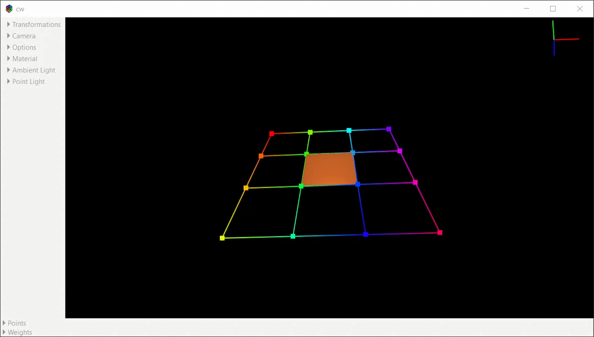
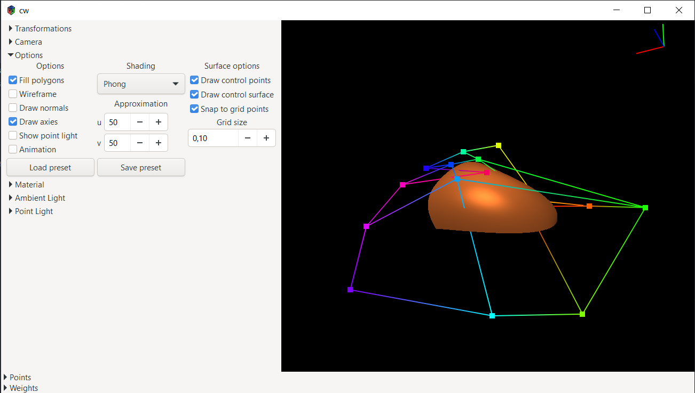
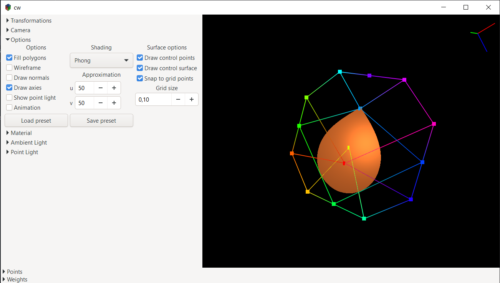